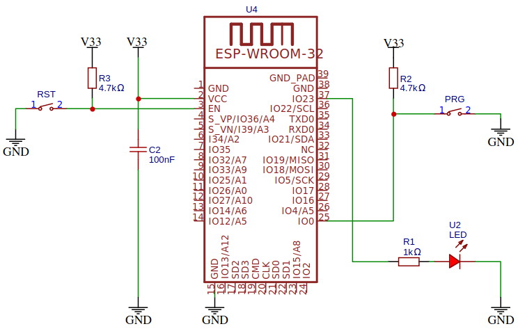

<h1>Catedra de Electrónica II</h1>
<h1>TP N°1 Led destellante</h1>
<h2>Indice</h2>

- [Introducción](#introducción)
- [Circuito](#circuito)
- [Clonar el repositorio](#clonar-el-repositorio)
- [Consigna](#consigna)
- [Licencia](#licencia)


## Introducción
El presente proyecto es el primero de una serie de trabajos prácticos de la asignatura Electrónica II del 4° año de la Carrera de Ingeniería Eléctrica. El proyecto implementa un microcontrolador ESP32 que incorpora un led que destella con un período determinado por la variable ```led_delay```.

## Circuito
En la figura se aprecia el circuito de este trabajo práctico, donde se observa que el led está en el pin físico 37 de la placa de desarrollo NODE-MCU32, que corresponde al puerto 23 (GPIO23) del microcontrolador.



## Clonar el repositorio
Abrir una terminal, dirigirse a la carpeta donde se encuentran los proyectos de Electrónica II y luego  correr el comando de git para clonar el repositorio.
El comando de clonación tiene la siguiente sintaxis:

```
git clone <https://github.com/nombre_de_usuario_github/repositorio> [directorio de destino]
```
Comandos para clonar este repositorio:
```
cd /home/admlca/electronicaII/platformio
git clone https://github.com/mcastellogh/UTN_ledTTL ledTT
```

## Consigna
Modificar el programa incorporando otra variable para poder hacer que los tiempos de encendido y apagado del led sean diferentes cambiando el valor de las dos variables correspondientes.


## Licencia
Este proyecto está licenciado bajo GPLV3.